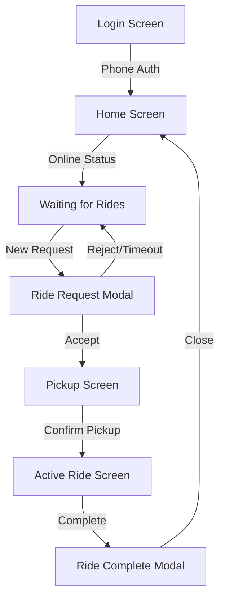

<div align="center">

# 🚲 AERAS Puller App

**Ultra-responsive Progressive Web App for E-Rickshaw Drivers**

[](https://react.dev/)
[](https://www.typescriptlang.org/)
[](https://vitejs.dev/)
[](https://tailwindcss.com/)
[](https://web.dev/progressive-web-apps/)
[](LICENSE)

</div>

---

## 📋 Overview

The AERAS Puller App is a mobile-first Progressive Web App designed for e-rickshaw drivers. It provides real-time ride notifications, GPS navigation, offline support, and instant communication with the backend system.

## ✨ Features

- 🔐 **Simple Authentication**: Phone number-based login
- 🌍 **Real-time GPS Tracking**: Automatic location updates every 5 seconds
- 🔔 **Loud Audio Alerts**: Never miss a ride request with audio notifications
- 📱 **Mobile-First Design**: Optimized for basic smartphones with responsive UI
- 🚀 **Offline Support**: PWA with service worker caching and offline functionality
- 🗺️ **Interactive Maps**: Turn-by-turn navigation with React Leaflet
- ⚡ **Real-time Communication**: WebSocket integration for instant updates
- 💰 **Live Points Tracking**: Real-time points balance and earnings
- ⏱️ **Smart Timers**: 30-second auto-reject for ride requests
- 🎯 **State Management**: Zustand for efficient state handling

## 🛠️ Tech Stack

| Technology | Version | Purpose |
|------------|---------|---------|
| React | 18.2 | UI Framework |
| TypeScript | 5.2 | Type Safety |
| Vite | 5.0 | Build Tool |
| Tailwind CSS | 3.3 | Styling |
| Zustand | 4.4 | State Management |
| Socket.IO Client | 4.6 | Real-time Communication |
| MQTT.js | 5.14 | IoT Messaging |
| React Leaflet | 4.2 | Interactive Maps |
| Axios | 1.6 | HTTP Client |
| Vite PWA Plugin | 0.17 | PWA Support |

## 📦 Installation

### Prerequisites

- **Node.js**: 18+ or 20+ (recommended)
- **pnpm**: Package manager
- **Backend**: AERAS backend server running

### Setup

1. **Clone the repository**:
```bash
git clone https://github.com/u2204125/aeras-puller-app.git
cd aeras-puller-app
```

2. **Install dependencies**:
```bash
pnpm install
```

3. **Configure environment variables**:
```bash
cp .env.example .env
```

Edit `.env` file:
```env
VITE_API_BASE_URL=http://localhost:3000
VITE_SOCKET_URL=http://localhost:3000
```

## 🚀 Development

## 🚀 Development

**Start development server**:
```bash
pnpm dev
```

The app will be available at `http://localhost:3001`

**Available Scripts**:
```bash
pnpm dev          # Start dev server with HMR
pnpm build        # Production build
pnpm preview      # Preview production build
pnpm lint         # Run ESLint
pnpm lint:fix     # Fix ESLint issues
pnpm format       # Format code with Prettier
pnpm format:check # Check code formatting
```

## 🏗️ Building for Production

## 🏗️ Building for Production

**Create production build**:
```bash
pnpm build
```

**Preview build locally**:
```bash
pnpm preview
```

The optimized PWA will be generated in the `dist/` directory with:
- Minified JavaScript bundles
- Service worker for offline support
- PWA manifest for installability
- Optimized assets and caching strategies

## 📁 Project Structure

## 📁 Project Structure

```
puller-app/
├── public/
│   └── manifest.json        # PWA manifest
├── src/
│   ├── components/          # React components
│   │   ├── LoginScreen.tsx
│   │   ├── HomeScreen.tsx
│   │   ├── RideRequestModal.tsx
│   │   ├── RideScreens.tsx
│   │   └── RideCompleteModal.tsx
│   ├── services/           # API and WebSocket services
│   │   ├── api.service.ts
│   │   └── socket.service.ts
│   ├── store/             # Zustand state management
│   │   └── appStore.ts
│   ├── types/             # TypeScript definitions
│   │   └── index.ts
│   ├── utils/             # Utility functions
│   │   ├── geolocation.ts
│   │   ├── soundAlert.ts
│   │   └── helpers.ts
│   ├── App.tsx            # Main app component
│   ├── main.tsx           # Entry point
│   └── index.css          # Global styles
├── .editorconfig          # Editor configuration
├── .prettierrc            # Prettier configuration
├── tailwind.config.js     # Tailwind CSS config
├── vite.config.ts         # Vite configuration
└── tsconfig.json          # TypeScript configuration
```

## 🔄 Screen Flow

## 🔄 Screen Flow



**Flow Details**:
1. **Login Screen** - Phone number authentication (search pullers endpoint)
2. **Home Screen** - Online/offline toggle, points balance display
3. **Ride Request Modal** - 30-second timer to accept/reject rides
4. **Pickup Screen** - Navigate to pickup location with live map
5. **Active Ride Screen** - Navigate to destination with ride timer
6. **Ride Complete Modal** - Points earned summary and feedback

## 🔌 API Integration

## 🔌 API Integration

The app integrates with the AERAS backend REST API:

| Endpoint | Method | Purpose |
|----------|--------|---------|
| `/pullers?search=<phone>` | GET | Login/find puller by phone |
| `/pullers/:id` | GET | Fetch puller details |
| `/pullers/:id/status` | PATCH | Update online/offline status |
| `/pullers/:id/location` | POST | Update GPS coordinates |
| `/rides/:id/accept` | POST | Accept ride request |
| `/rides/:id/reject` | POST | Reject ride request |
| `/rides/:id/pickup` | POST | Confirm passenger pickup |
| `/rides/:id/complete` | POST | Mark ride as completed |

## 📡 WebSocket Events

## 📡 WebSocket Events

**Emitted by Client**:
- `register_puller` - Register puller connection with ID

**Received from Server**:
- `new_ride_request` - New ride available (with rider details, pickup, destination)
- `ride_filled` - Ride accepted by another puller (dismiss request)
- `ride_update` - Real-time ride status changes

**Socket.IO Connection**:
```typescript
const socket = io(VITE_SOCKET_URL, {
  transports: ['websocket'],
  autoConnect: false
});
```

## 📱 PWA Features

- ✅ **Installable**: Add to home screen on mobile devices
- ✅ **Offline-First**: Service worker with intelligent caching
- ✅ **App Shell**: Cached UI for instant loading
- ✅ **Network Strategies**: Network-first for API, cache-first for assets
- ✅ **Standalone Mode**: Fullscreen experience without browser chrome
- ✅ **Auto-Update**: Automatic service worker updates
- ✅ **Background Sync**: Queue failed requests for retry

**Installation Prompt**:
The app automatically shows an install prompt on compatible browsers. Users can install it like a native app.

## 🌐 Browser Support

| Browser | Minimum Version |
|---------|----------------|
| Chrome (Android) | 70+ |
| Safari (iOS) | 12+ |
| Firefox | Latest |
| Edge | Latest |
| Samsung Internet | Latest |

**PWA Support**: Full PWA features on Android Chrome and iOS Safari 12+.

## 🤝 Contributing

We welcome contributions! Please see [CONTRIBUTING.md](CONTRIBUTING.md) for details.

## 📄 License

This project is licensed under the MIT License - see the [LICENSE](LICENSE) file for details.

## 📞 Support

- **Issues**: [GitHub Issues](https://github.com/u2204125/aeras-puller-app/issues)
- **Documentation**: See `TESTING_GUIDE.md` and `RIDE_FLOW_AUTOMATION.md` for detailed guides
- **Email**: Contact the AERAS development team

---

<div align="center">

**Built with ❤️ for E-Rickshaw Drivers**

[Report Bug](https://github.com/u2204125/aeras-puller-app/issues) · [Request Feature](https://github.com/u2204125/aeras-puller-app/issues)

</div>
